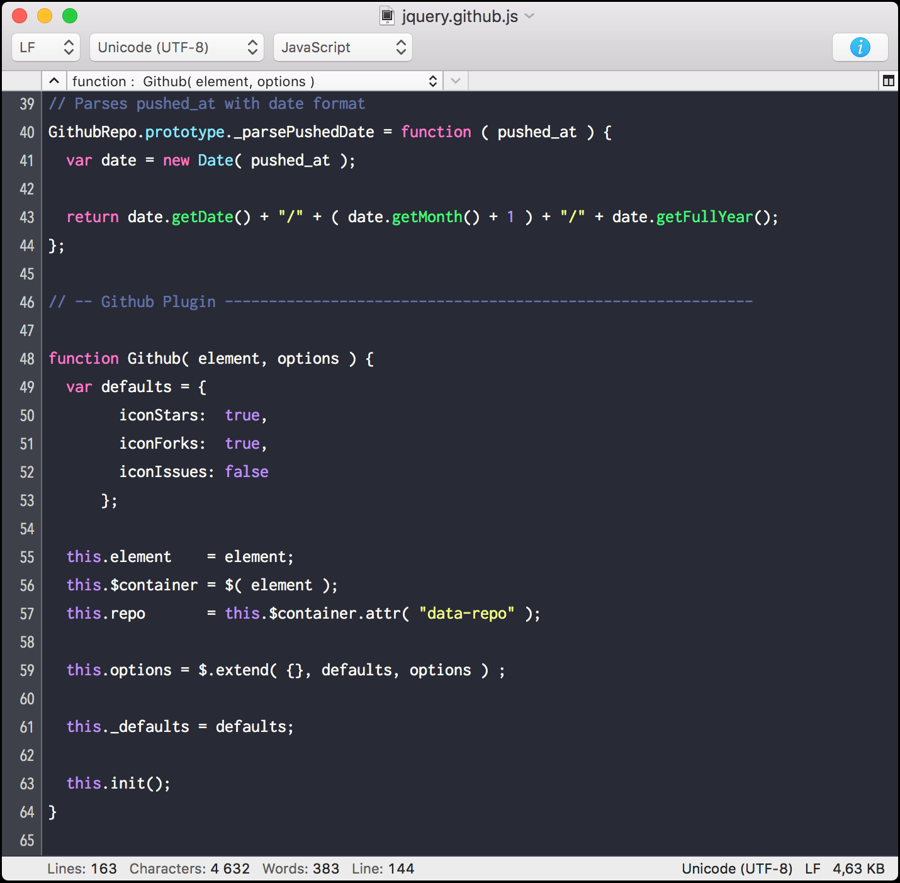

# Dracula for [CotEditor](https://coteditor.com)

> A dark theme for [CotEditor](https://coteditor.com).

## How to install

1. Start CotEditor
2. Go to `Preferences -> Appearance`
3. Click the gear icon    and then select `Import...`
4. Find and select the `Dracula.cottheme` file and click `Import`
6. Click the `Dracula` theme to apply it
7. Embrace the darkness 🎉

## Team

This theme is maintained by the following person(s) and a bunch of [awesome contributors](https://github.com/dracula/coteditor/graphs/contributors).

 |
--- |
[William Grant](https://github.com/yougotwill) |

## License

[MIT License](./LICENSE)